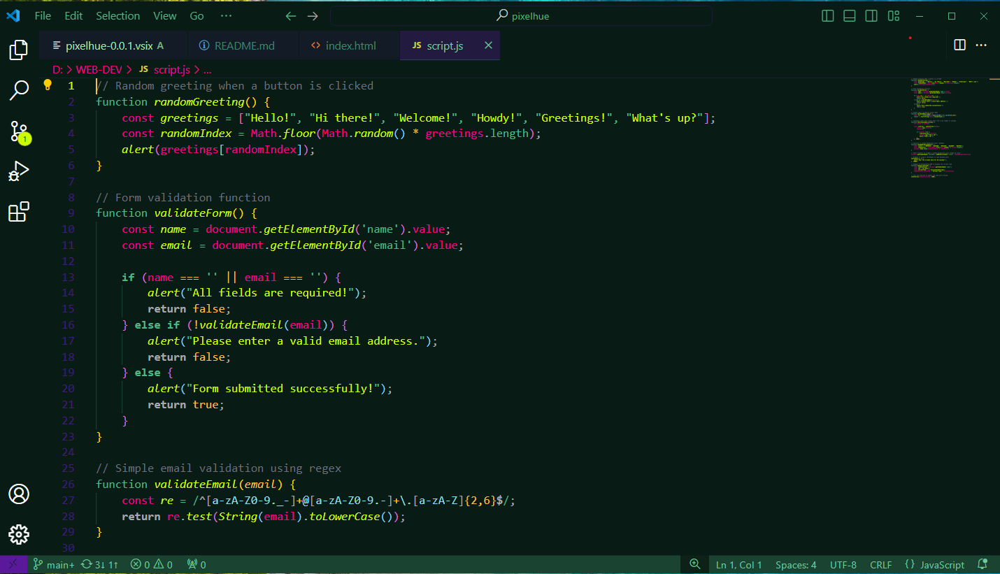
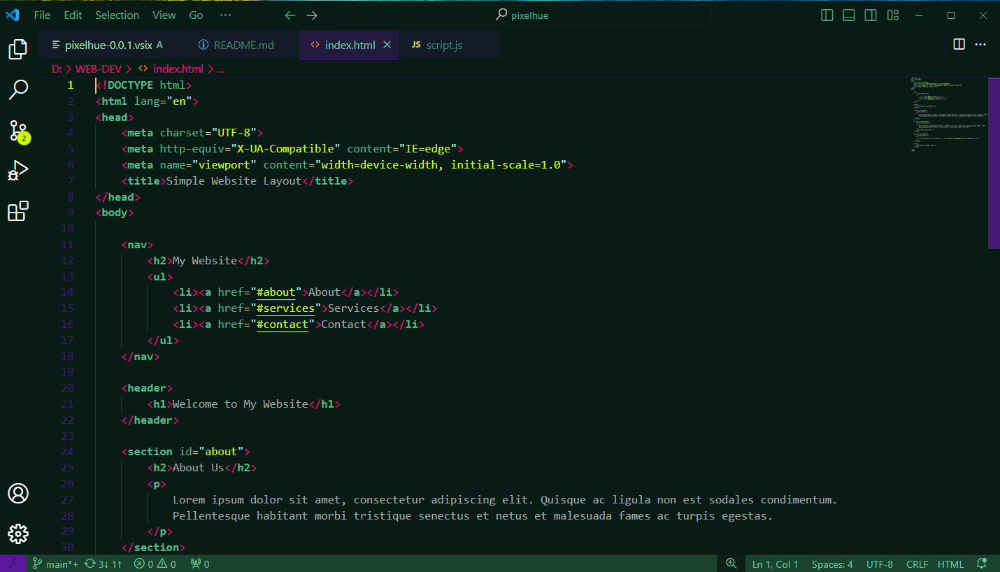
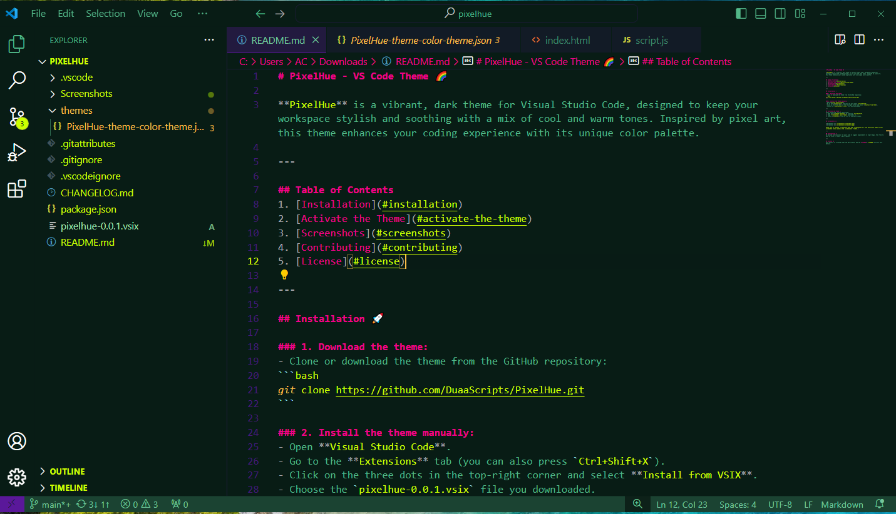

# PixelHue - VS Code Theme 🌈

**PixelHue** is a vibrant, dark theme for Visual Studio Code, designed to keep your workspace stylish and soothing with a mix of cool and warm tones. Inspired by pixel art, this theme enhances your coding experience with its unique color palette.

---

## Table of Contents
1. [Installation](#installation)
2. [Activate the Theme](#activate-the-theme)
3. [Screenshots](#screenshots)
4. [Contributing](#contributing)
5. [License](#license)

---

## Installation 🚀

### 1. Download the theme:
- Clone or download the theme from the GitHub repository:
```bash
git clone https://github.com/DuaaScripts/PixelHue.git
```

### 2. Install the theme manually:
- Open **Visual Studio Code**.
- Go to the **Extensions** tab (you can also press `Ctrl+Shift+X`).
- Click on the three dots in the top-right corner and select **Install from VSIX**.
- Choose the `pixelhue-0.0.1.vsix` file you downloaded.

---

## Activate the Theme 🌟
After installing, follow these steps:
1. Open the **Command Palette** by pressing `Ctrl+Shift+P`.
2. Type `Preferences: Color Theme` and select it.
3. Choose **PixelHue** from the list of available themes.

---

## Screenshots 📸





---

## Contributing 🤝
We welcome contributions! If you'd like to suggest improvements or report bugs, feel free to open an issue or submit a pull request.

---

## License 📄
This project is licensed under the MIT License. See the [LICENSE](./License) file for more details.
